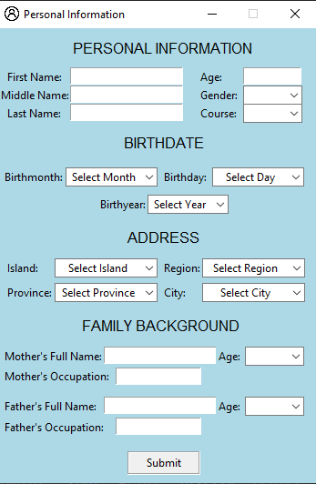
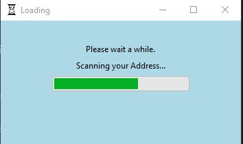

## 🖥️ Tkinter Simple Survey
<h3>A beginner-friendly survey application built with Python's Tkinter GUI library.</h3>

## 📌 About the Project
<h4>
This simple survey app collects user input through a graphical interface. I created it as my first project using Tkinter just for fun!
  
  
Through this project, I tried:

- Building GUI layouts with Tkinter

- Using entry fields, buttons, and labels

- Handling user input, events and key bindings>

- Applying basic design and layout logic
</h4>

## 🎯 Features
<h4>
- Clean and simple interface

- Input fields for user responses (e.g., name, age, feedback, etc.)

- Submit button that processes user data

- Warning Message

- Tkk Progressbar with changing text label while loading</h4>

## 📸 Screenshots

## 📝 Personal Note
<h4>"This project is just a small step to gain more knowledge and experience, but it means a lot to me, so thanks for checking it out!"</h4>

## 🛠️ Tech Stack
<h4>
Language: Python🐍

GUI Library: Tkinter (built-in with Python)
</h4>
